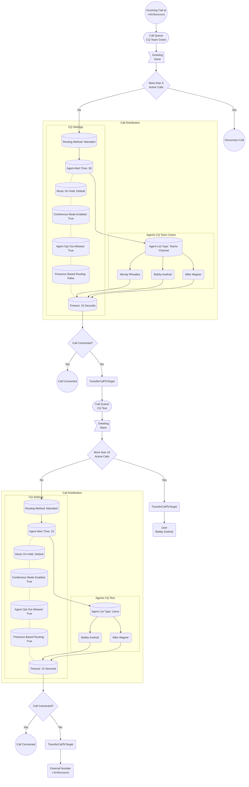

```mermaid
flowchart TB
start((Incoming Call at <br> +4143xxxxxxx)) --> elementAA([Call Queue <br> CQ Team Green]) --> cqGreeting1>Greeting <br> None]
--> overFlow1{More than 5 <br> Active Calls}
overFlow1 ---> |Yes| cqOverFlowAction1((Disconnect Call))
overFlow1 ---> |No| routingMethod1


subgraph Call Distribution
subgraph CQ Settings
routingMethod1[(Routing Method: Attendant)] --> agentAlertTime1
agentAlertTime1[(Agent Alert Time: 30)] -.- cqMusicOnHold1
cqMusicOnHold1[(Music On Hold: Default)] -.- conferenceMode1
conferenceMode1[(Conference Mode Enabled: True)] -.- agentOptOut1
agentOptOut1[(Agent Opt Out Allowed: True)] -.- presenceBasedRouting1
presenceBasedRouting1[(Presence Based Routing: False)] -.- timeOut1
timeOut1[(Timeout: 15 Seconds)]
end
subgraph Agents CQ Team Green
agentAlertTime1 --> agentListType1[(Agent List Type: Teams Channel)]
agentListType1 --> agent11(Wendy Rhoades) --> timeOut1
agentListType1 --> agent12(Bobby Axelrod) --> timeOut1
agentListType1 --> agent13(Mike Wagner) --> timeOut1

end
end

timeOut1 --> cqResult1{Call Connected?}
cqResult1 --> |Yes| cqEnd1((Call Connected))
cqResult1 --> |No| cqTimeoutAction1(TransferCallToTarget) --> cqTimeoutActionTarget1([Call Queue <br> CQ Test]) --> 
cqGreeting2>Greeting <br> None]
--> overFlow2{More than 10 <br> Active Calls}
overFlow2 ---> |Yes| cqOverFlowAction2(TransferCallToTarget) --> cqOverFlowActionTarget2(User <br> Bobby Axelrod)
overFlow2 ---> |No| routingMethod2


subgraph Call Distribution
subgraph CQ Settings
routingMethod2[(Routing Method: Attendant)] --> agentAlertTime2
agentAlertTime2[(Agent Alert Time: 15)] -.- cqMusicOnHold2
cqMusicOnHold2[(Music On Hold: Default)] -.- conferenceMode2
conferenceMode2[(Conference Mode Enabled: True)] -.- agentOptOut2
agentOptOut2[(Agent Opt Out Allowed: True)] -.- presenceBasedRouting2
presenceBasedRouting2[(Presence Based Routing: True)] -.- timeOut2
timeOut2[(Timeout: 15 Seconds)]
end
subgraph Agents CQ Test
agentAlertTime2 --> agentListType2[(Agent List Type: Users)]
agentListType2 --> agent21(Bobby Axelrod) --> timeOut2
agentListType2 --> agent22(Mike Wagner) --> timeOut2

end
end

timeOut2 --> cqResult2{Call Connected?}
cqResult2 --> |Yes| cqEnd2((Call Connected))
cqResult2 --> |No| cqTimeoutAction2(TransferCallToTarget) --> cqTimeoutActionTarget2(External Number <br> +4144xxxxxxx)


```
