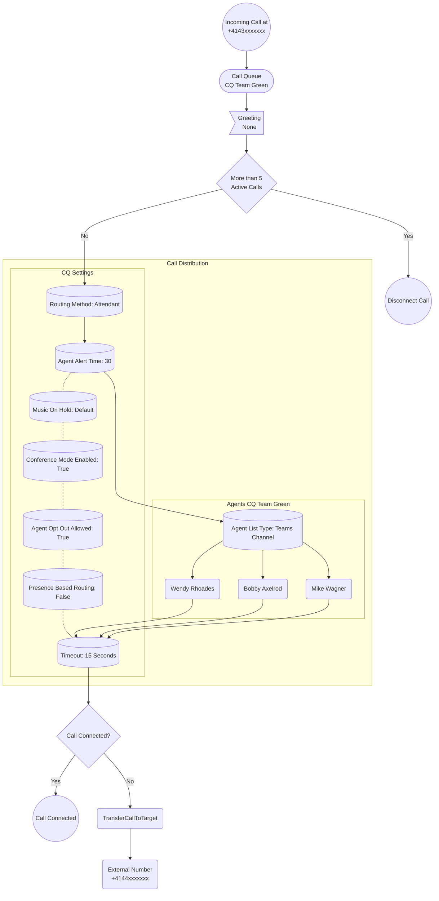

```mermaid
flowchart TB
start((Incoming Call at <br> +4143xxxxxxx)) --> elementAA([Call Queue <br> CQ Team Green]) --> cqGreeting1>Greeting <br> None]
--> overFlow1{More than 5 <br> Active Calls}
overFlow1 ---> |Yes| cqOverFlowAction1((Disconnect Call))
overFlow1 ---> |No| routingMethod1


subgraph Call Distribution
subgraph CQ Settings
routingMethod1[(Routing Method: Attendant)] --> agentAlertTime1
agentAlertTime1[(Agent Alert Time: 30)] -.- cqMusicOnHold1
cqMusicOnHold1[(Music On Hold: Default)] -.- conferenceMode1
conferenceMode1[(Conference Mode Enabled: True)] -.- agentOptOut1
agentOptOut1[(Agent Opt Out Allowed: True)] -.- presenceBasedRouting1
presenceBasedRouting1[(Presence Based Routing: False)] -.- timeOut1
timeOut1[(Timeout: 15 Seconds)]
end
subgraph Agents CQ Team Green
agentAlertTime1 --> agentListType1[(Agent List Type: Teams Channel)]
agentListType1 --> agent11(Wendy Rhoades) --> timeOut1
agentListType1 --> agent12(Bobby Axelrod) --> timeOut1
agentListType1 --> agent13(Mike Wagner) --> timeOut1

end
end

timeOut1 --> cqResult1{Call Connected?}
cqResult1 --> |Yes| cqEnd1((Call Connected))
cqResult1 --> |No| cqTimeoutAction1(TransferCallToTarget) --> cqTimeoutActionTarget1(External Number <br> +4144xxxxxxx)


```
