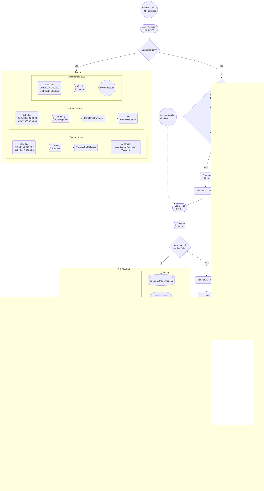

```mermaid
flowchart TB
start((Incoming Call at <br> +4144xxxxxxx)) --> elementAA([Auto Attendant <br> PS Test AA]) --> 
elementHolidayCheck{During Holiday?} -->|Yes| Holidays
elementHolidayCheck{During Holiday?} -->|No| elementAfterHoursCheck{During Business Hours? <br> Monday Hours: 06:00:00-18:00:00, 20:00:00-21:00:00 <br> Tuesday Hours: 06:00:00-18:00:00  <br> Wednesday Hours: 06:00:00-18:00:00  <br> Thursday Hours: 06:00:00-18:00:00 <br> Friday Hours: 06:00:00-18:00:00 <br> Saturday Hours: Open 24 hours <br> Sunday Hours: Closed}
    elementAfterHoursCheck{During Business Hours? <br> Monday Hours: 06:00:00-18:00:00, 20:00:00-21:00:00 <br> Tuesday Hours: 06:00:00-18:00:00  <br> Wednesday Hours: 06:00:00-18:00:00  <br> Thursday Hours: 06:00:00-18:00:00 <br> Friday Hours: 06:00:00-18:00:00 <br> Saturday Hours: Open 24 hours <br> Sunday Hours: Closed} -->|Yes| defaultCallFlowGreeting>Greeting <br> None] --> defaultCallFlow(TransferCallToTarget) --> defaultCallFlowAction([Call Queue <br> CQ Test]) --> cqGreeting>Greeting <br> None]
--> overFlow{More than 10 <br> Active Calls}
overFlow --> |Yes| cqOverFlowAction(TransferCallToTarget) --> cqOverFlowActionTarget(User <br> Bobby Axelrod)
overFlow --> |No| routingMethod

start2((Incoming Call at <br> tel:+4144xxxxxxx)) -...-> defaultCallFlowAction

subgraph Call Distribution
    subgraph CQ Settings
    routingMethod[(Routing Method: Attendant)] --> agentAlertTime
    agentAlertTime[(Agent Alert Time: 15)] -.- cqMusicOnHold
    cqMusicOnHold[(Music On Hold: Default)] -.- conferenceMode
    conferenceMode[(Conference Mode Enabled: True)] -.- agentOptOut
    agentOptOut[(Agent Opt Out Allowed: True)] -.- presenceBasedRouting
    presenceBasedRouting[(Presence Based Routing: True)] -.- timeOut
    timeOut[(Timeout: 15 Seconds)]
    end
    subgraph Agents
    agentAlertTime --> agentListType[(Agent List Type: Users)]
    agentListType --> agent1(Bobby Axelrod) --> timeOut
agentListType --> agent2(Mike Wagner) --> timeOut
agentListType --> agent3(Wendy Rhoades) --> timeOut

    end
end

timeOut --> cqResult{Call Connected?}
    cqResult --> |Yes| cqEnd((Call Connected))
    cqResult --> |No| cqTimeoutAction(TransferCallToTarget) --> cqTimeoutActionTarget(External Number <br> +4144xxxxxxx)

    elementAfterHoursCheck{During Business Hours? <br> Monday Hours: 06:00:00-18:00:00, 20:00:00-21:00:00 <br> Tuesday Hours: 06:00:00-18:00:00  <br> Wednesday Hours: 06:00:00-18:00:00  <br> Thursday Hours: 06:00:00-18:00:00 <br> Friday Hours: 06:00:00-18:00:00 <br> Saturday Hours: Open 24 hours <br> Sunday Hours: Closed} -->|No| afterHoursCallFlowGreeting>Greeting <br> AudioFile] --> afterHoursCallFlow(TransferCallToTarget) --> afterHoursCallFlowAction(Voicemail <br> Axe Capital Reception Voicemail)

subgraph Holidays
    direction LR        
        subgraph Tag der Arbeit
        direction LR
        elementAAHoliday1(Schedule <br> 05/01/2019 00:00:00 <br> 05/02/2019 00:00:00) --> elementAAHolidayGreeting1>Greeting <br> AudioFile] --> elementAAHolidayAction1(TransferCallToTarget) --> elementAAHolidayActionTargetType1(Voicemail <br> Axe Capital Reception Voicemail)
            end        
        subgraph Neujahrstag 2021
        direction LR
        elementAAHoliday2(Schedule <br> 01/01/2020 00:00:00 <br> 01/02/2020 00:00:00) --> elementAAHolidayGreeting2>Greeting <br> TextToSpeech] --> elementAAHolidayAction2(TransferCallToTarget) --> elementAAHolidayActionTargetType2(User <br> Wendy Rhoades)
            end        
        subgraph Ostermontag 2021
        direction LR
        elementAAHoliday3(Schedule <br> 04/13/2020 00:00:00 <br> 04/14/2020 00:00:00) --> elementAAHolidayGreeting3>Greeting <br> None] --> elementAAHolidayAction3((DisconnectCall))
            end
end


```
