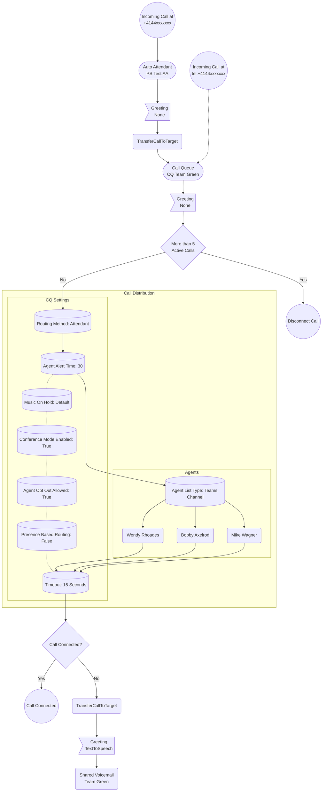

```mermaid
flowchart TB
start((Incoming Call at <br> +4144xxxxxxx)) --> elementAA([Auto Attendant <br> PS Test AA]) --> defaultCallFlowGreeting>Greeting <br> None] --> defaultCallFlow(TransferCallToTarget) --> defaultCallFlowAction([Call Queue <br> CQ Team Green]) --> cqGreeting>Greeting <br> None]
--> overFlow{More than 5 <br> Active Calls}
overFlow --> |Yes| cqOverFlowAction((Disconnect Call))
overFlow --> |No| routingMethod

start2((Incoming Call at <br> tel:+4144xxxxxxx)) -...-> defaultCallFlowAction

subgraph Call Distribution
    subgraph CQ Settings
    routingMethod[(Routing Method: Attendant)] --> agentAlertTime
    agentAlertTime[(Agent Alert Time: 30)] -.- cqMusicOnHold
    cqMusicOnHold[(Music On Hold: Default)] -.- conferenceMode
    conferenceMode[(Conference Mode Enabled: True)] -.- agentOptOut
    agentOptOut[(Agent Opt Out Allowed: True)] -.- presenceBasedRouting
    presenceBasedRouting[(Presence Based Routing: False)] -.- timeOut
    timeOut[(Timeout: 15 Seconds)]
    end
    subgraph Agents
    agentAlertTime --> agentListType[(Agent List Type: Teams Channel)]
    agentListType --> agent1(Wendy Rhoades) --> timeOut
agentListType --> agent2(Bobby Axelrod) --> timeOut
agentListType --> agent3(Mike Wagner) --> timeOut

    end
end

timeOut --> cqResult{Call Connected?}
    cqResult --> |Yes| cqEnd((Call Connected))
    cqResult --> |No| cqTimeoutAction(TransferCallToTarget) --> cqTimeoutVoicemailGreeting>Greeting <br> TextToSpeech] --> cqTimeoutActionTarget(Shared Voicemail <br> Team Green)


```
