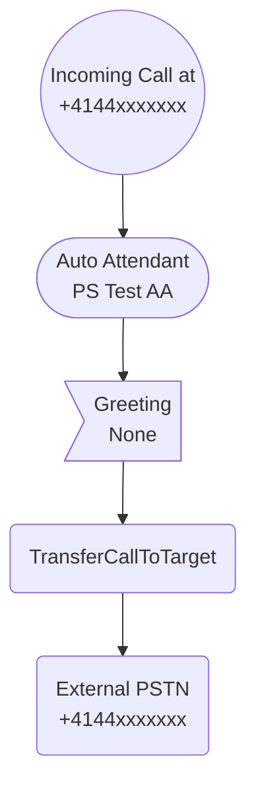

```mermaid
flowchart TB
start((Incoming Call at <br> +4144xxxxxxx)) --> elementAA([Auto Attendant <br> PS Test AA]) --> defaultCallFlowGreeting>Greeting <br> None] --> defaultCallFlow(TransferCallToTarget) --> defaultCallFlowAction(External PSTN <br> +4144xxxxxxx)


```
