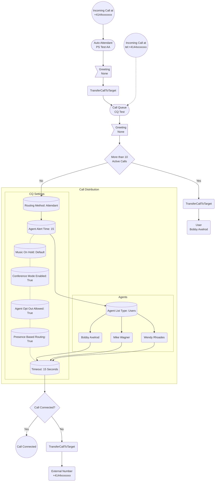

```mermaid
flowchart TB
start((Incoming Call at <br> +4144xxxxxxx)) --> elementAA([Auto Attendant <br> PS Test AA]) --> defaultCallFlowGreeting>Greeting <br> None] --> defaultCallFlow(TransferCallToTarget) --> defaultCallFlowAction([Call Queue <br> CQ Test]) --> cqGreeting>Greeting <br> None]
--> overFlow{More than 10 <br> Active Calls}
overFlow --> |Yes| cqOverFlowAction(TransferCallToTarget) --> cqOverFlowActionTarget(User <br> Bobby Axelrod)
overFlow --> |No| routingMethod

start2((Incoming Call at <br> tel:+4144xxxxxxx)) -...-> defaultCallFlowAction

subgraph Call Distribution
    subgraph CQ Settings
    routingMethod[(Routing Method: Attendant)] --> agentAlertTime
    agentAlertTime[(Agent Alert Time: 15)] -.- cqMusicOnHold
    cqMusicOnHold[(Music On Hold: Default)] -.- conferenceMode
    conferenceMode[(Conference Mode Enabled: True)] -.- agentOptOut
    agentOptOut[(Agent Opt Out Allowed: True)] -.- presenceBasedRouting
    presenceBasedRouting[(Presence Based Routing: True)] -.- timeOut
    timeOut[(Timeout: 15 Seconds)]
    end
    subgraph Agents
    agentAlertTime --> agentListType[(Agent List Type: Users)]
    agentListType --> agent1(Bobby Axelrod) --> timeOut
agentListType --> agent2(Mike Wagner) --> timeOut
agentListType --> agent3(Wendy Rhoades) --> timeOut

    end
end

timeOut --> cqResult{Call Connected?}
    cqResult --> |Yes| cqEnd((Call Connected))
    cqResult --> |No| cqTimeoutAction(TransferCallToTarget) --> cqTimeoutActionTarget(External Number <br> +4144xxxxxxx)


```
